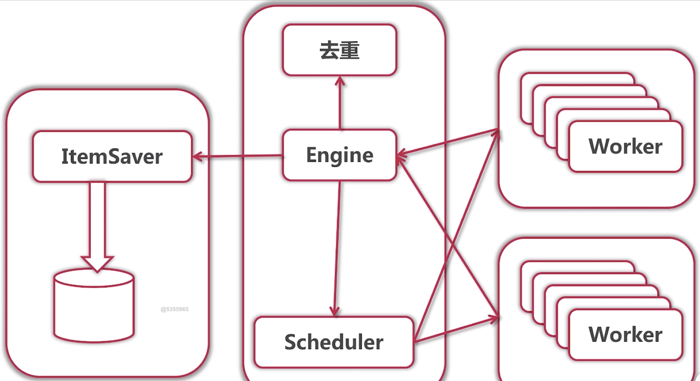

# crawlerInGo
This is a crawler implemented in Go from basic version to distributed version.

## Distributed Web crawler
### Problems
1. qps limit on a single node  
	A: Distribute Worker into each node
2. deduplication   
	A: based on key-value store, e.g. Redis 
3. data storage  
	A: Data storage service
	  
	
### JsonRPC


using **Service.Method**  
rpc requires   

```
type DemoService struct {}  
func (DemoService) {func name} (args Args, result *type) error {}
```

#### server

```
rpc.Register(DemoService{})
listener, error := net.Listen("tcp",":1234")
// ...
for {
	conn, err := listener.Accept()
	// ...
	go jsonrpc.ServeConn(conn)
}

``` 

```
telnet localhost 1234 
{"method":"DemoService.{func name}","params":[xx:yy,aa:bb],"id":1}
```

#### client
```
conn, err := net.Dial("tcp","1234")
var result interface{}
client := jsonrpc.NewClient(conn)
client.Call("DemoService.{func name}",Args{**},&result)

```

To start a server, we first start main.go in server, then external method can call client method to call RPC.

### ParserFunc Serialization
serialize parse function to do RPC request

### Start Server
TODO

